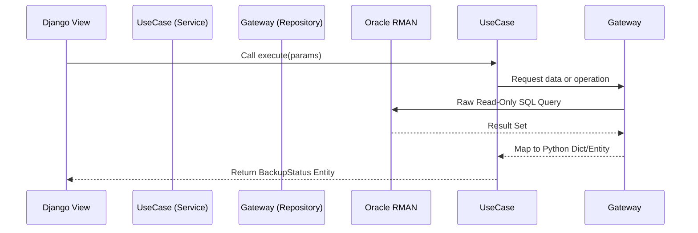

# Architecture Notes

## Request Flow

## Current Structure

- `projectRelback/`: project configuration and root URLs.
- `coreRelback/`: domain app with models, forms, views and templates.
- `static/`: shared static assets.
- `databaseProject/`: SQL artifacts and operational scripts.

## Architectural Guardrails

- Keep views slim and cohesive.
- Move reusable domain logic to services/helpers.
- Prefer explicit migrations for model evolution.
- Keep template behavior server-first with minimal JS coupling.
- Oracle Catalog queries must be encapsulated in read-only gateways, ensuring Django never attempts accidental writes to Oracle RMAN system tables.
